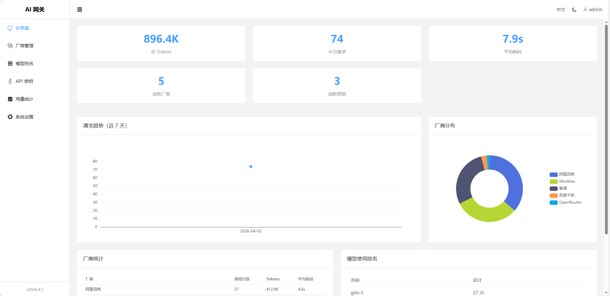
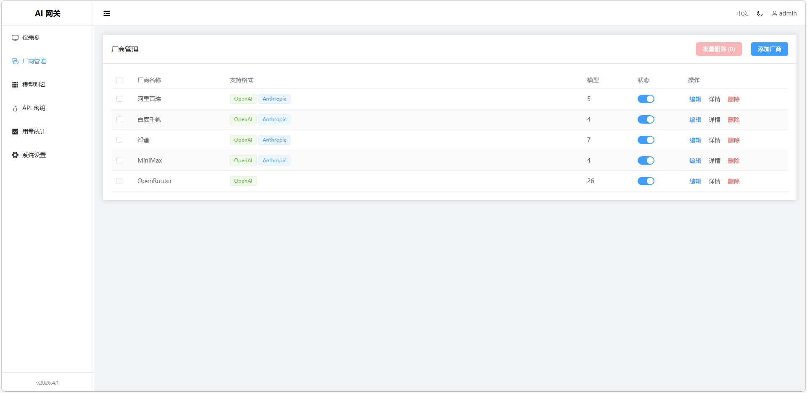
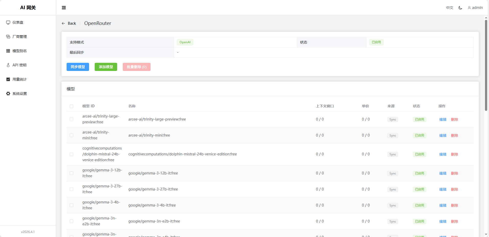
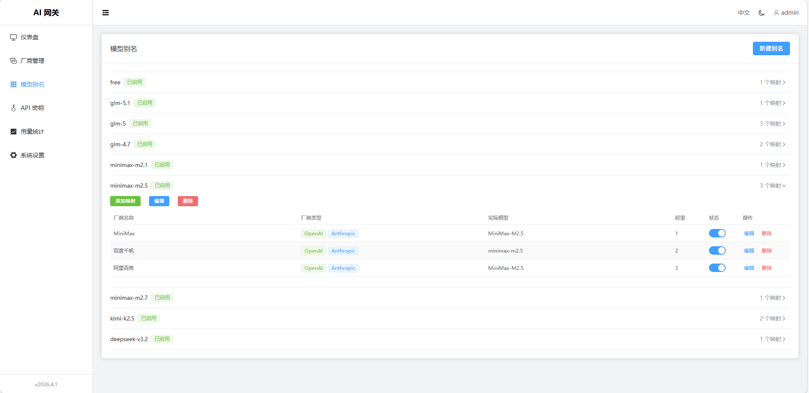
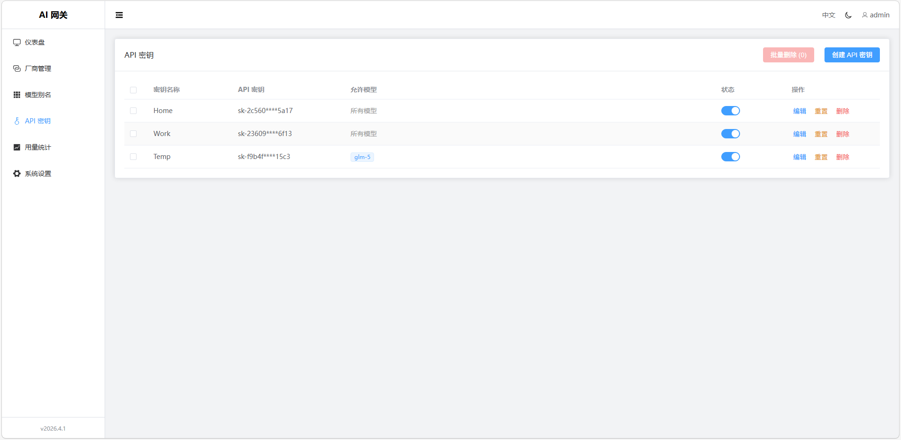
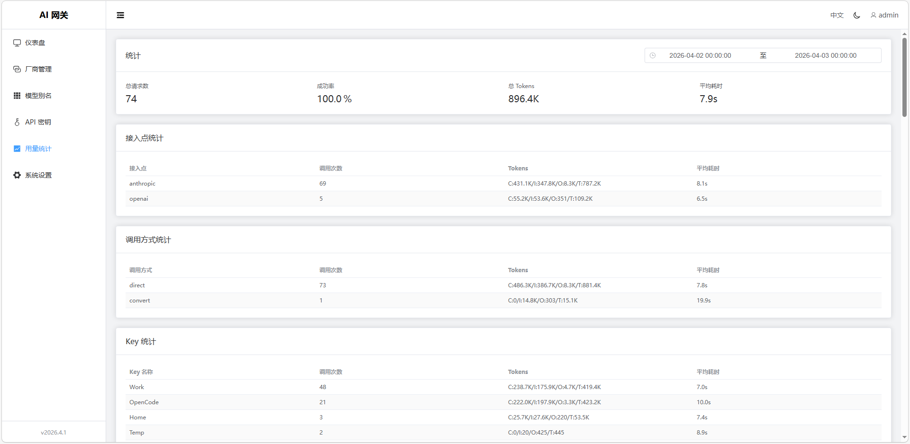
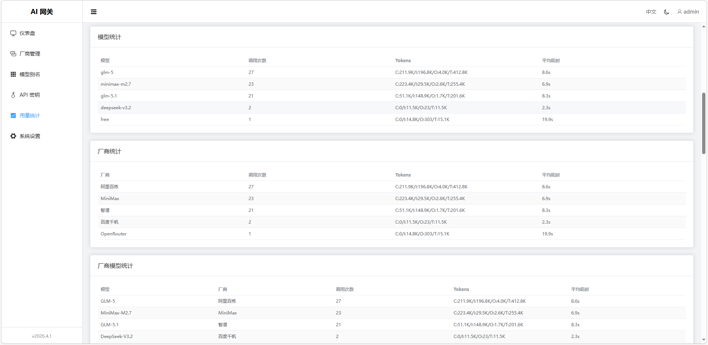
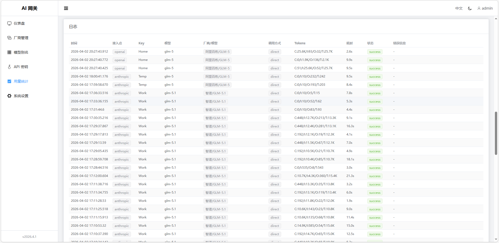

# AI Gateway
---

**此项目是作者学习大模型接口的副产物，最早的核心功能仅仅是实现 OpenAI/Anthropic API 的相互转换。**
**目前转换功能能处理文字内容（包括 “context”、“thinking”、“tools”），多模态转换从未尝试过。**

统一的 AI 服务网关平台。聚合多个大模型厂商的 API 为 OpenAI 兼容格式，未来将扩展支持 MCP/ACP 等协议代理，打造多协议 AI 服务接入中心。

## 特性

- **多协议网关**: 当前支持 OpenAI/Anthropic API 代理，未来将支持 MCP 等协议
- **OpenAI 兼容 API**: 暴露标准的 `/openai/v1/chat/completions` 和 `/openai/v1/models` 接口
- **Anthropic 兼容 API**: 暴露标准的 `/anthropic/v1/messages` 和 `/anthropic/v1/models` 接口
- **多厂商支持**: 支持多种 AI 服务厂商，可轻松扩展
- **格式自动转换**: OpenAI ↔ Anthropic 请求/响应格式自动转换
- **智能路由**: 支持多厂商轮询、故障转移和格式匹配优化
- **API Key 管理**: 生成和管理网关 API Key，支持模型访问权限控制
- **用量统计**: 请求日志和用量仪表盘，实时监控服务调用
- **Web 控制台**: Vue 3 管理界面，支持中英文、暗色模式

## 外观

| 仪表盘 | 厂商列表 | 厂商模型 | 模型映射 | 密钥管理 |
| --- | --- | --- | --- | --- |
|  |  |  |  |  |

| 日志统计 | 日志统计 | 日志统计 |
| --- | --- | --- |
|  |  |  |

## 快速开始

### 环境要求

- Go 1.21+
- Node.js 18+

### 安装运行

```bash
# 克隆项目
git clone https://github.com/lx0758/AI_Gateway.git ai-gateway

# 构建
cd ai-gateway
make

# 单独构建前端
cd ai-gateway/web
make

# 单独构建后端
cd ai-gateway/server
make
```
> 编译产物在 `ai-gateway/server/bin/ai-gateway-server`

服务启动后访问 <http://localhost:18080>

### 默认账号

- 用户名: `admin`
- 密码: `admin`

## 配置

使用环境变量配置，所有变量以 `AG_` 为前缀：

| 变量名 | 默认值 | 说明 |
|--------|--------|------|
| `AG_SERVER_PORT` | `18080` | 服务端口 |
| `AG_SERVER_MODE` | `debug` | 运行模式 (debug/release) |
| `AG_DATABASE_PATH` | `data.db` | SQLite 数据库路径 |
| `AG_SESSION_SECRET` | (自动生成) | Session 密钥，未设置时自动生成 |
| `AG_SESSION_MAX_AGE` | `86400` | Session 有效期(秒) |
| `AG_SESSION_SECURE` | `false` | Cookie Secure 标志 |
| `AG_SESSION_HTTP_ONLY` | `true` | Cookie HttpOnly 标志 |
| `AG_SESSION_SAME_SITE` | `lax` | Cookie SameSite 属性 |
| `AG_ADMIN_USERNAME` | `admin` | 默认管理员用户名 |
| `AG_ADMIN_PASSWORD` | `admin` | 默认管理员密码 |

### 示例

```bash
# 使用自定义端口
AG_SERVER_PORT=3000 \
./ai-gateway-server

# 生产环境配置
AG_SERVER_MODE=release \
AG_SESSION_SECRET=your-secret-key \
AG_ADMIN_PASSWORD=secure-password \
./ai-gateway-server
```

## API 接口

### OpenAI 兼容接口 (需要 API Key)

```
POST /openai/v1/chat/completions   # 聊天补全
GET  /openai/v1/models             # 模型列表
GET  /openai/v1/models/:id         # 模型详情
```

### Anthropic 兼容接口 (需要 API Key)

```
POST /anthropic/v1/messages        # Anthropic Messages API
GET  /anthropic/v1/models          # 模型列表
POST /anthropic/v1/models/:id      # 模型详情
```

### 管理接口 (需要登录)

```
POST /api/v1/auth/login     # 登录
POST /api/v1/auth/logout    # 登出
GET  /api/v1/auth/me        # 当前用户
PUT  /api/v1/auth/password  # 修改密码

GET  /api/v1/providers      # 厂商列表
POST /api/v1/providers      # 创建厂商
PUT  /api/v1/providers/:id  # 更新厂商
DELETE /api/v1/providers/:id # 删除厂商
POST /api/v1/providers/:id/test  # 测试连接
POST /api/v1/providers/:id/sync  # 同步模型

GET  /api/v1/aliases        # 模型别名列表
POST /api/v1/aliases        # 创建别名
PUT  /api/v1/aliases/:id    # 更新别名
DELETE /api/v1/aliases/:id  # 删除别名

GET  /api/v1/api-keys       # API Key 列表
POST /api/v1/api-keys       # 创建 API Key
PUT  /api/v1/api-keys/:id   # 更新 API Key
DELETE /api/v1/api-keys/:id # 删除 API Key
POST /api/v1/api-keys/:id/reset # 重置 API Key

GET  /api/v1/usage/stats    # 用量统计
GET  /api/v1/usage/logs     # 用量日志
GET  /api/v1/usage/dashboard # 仪表盘数据
```

## 使用示例

### 1. 添加厂商

```bash
# 添加支持 OpenAI 格式的厂商
curl -X POST http://localhost:18080/api/v1/providers \
  -H "Content-Type: application/json" \
  -b "session=your-session-cookie" \
  -d '{
    "name": "OpenAI",
    "openai_base_url": "https://api.openai.com/v1",
    "api_key": "sk-xxx"
  }'

# 添加支持 Anthropic 格式的厂商
curl -X POST http://localhost:18080/api/v1/providers \
  -H "Content-Type: application/json" \
  -b "session=your-session-cookie" \
  -d '{
    "name": "Anthropic",
    "anthropic_base_url": "https://api.anthropic.com/v1",
    "api_key": "sk-xxx"
  }'
```

### 2. 创建模型别名

```bash
curl -X POST http://localhost:18080/api/v1/aliases \
  -H "Content-Type: application/json" \
  -b "session=your-session-cookie" \
  -d '{
    "name": "gpt-4",
    "mappings": [
      {"provider_id": 1, "model_name": "gpt-4-turbo-preview", "weight": 100}
    ]
  }'
```

### 3. 创建 API Key

```bash
curl -X POST http://localhost:18080/api/v1/api-keys \
  -H "Content-Type: application/json" \
  -b "session=your-session-cookie" \
  -d '{
    "name": "my-api-key",
    "models": ["gpt-4"]
  }'
```

### 4. 重置 API Key

```bash
# 重置 API Key，生成新的 Key 值并保留原有配置
curl -X POST http://localhost:18080/api/v1/api-keys/1/reset \
  -b "session=your-session-cookie"

# 响应示例
{
  "key": {
    "id": 1,
    "key": "sk-abc123****xyz9",
    "name": "my-api-key",
    "enabled": true,
    "expires_at": null,
    "created_at": "2024-01-01T00:00:00Z",
    "models": [{"id": 1, "model": "gpt-4"}]
  },
  "raw_key": "sk-abc123def456789xyz9"
}
```

**注意**: `raw_key` 仅在重置时返回一次，请立即保存。旧 Key 值将立即失效。

### 5. 调用网关 API

```bash
# OpenAI 格式调用
curl http://localhost:18080/openai/v1/chat/completions \
  -H "Authorization: Bearer sk-your-key" \
  -H "Content-Type: application/json" \
  -d '{
    "model": "gpt-4",
    "messages": [{"role": "user", "content": "Hello!"}]
  }'

# Anthropic 格式调用
curl http://localhost:18080/anthropic/v1/messages \
  -H "x-api-key: sk-your-key" \
  -H "Content-Type: application/json" \
  -d '{
    "model": "claude-3-opus",
    "max_tokens": 1024,
    "messages": [{"role": "user", "content": "Hello!"}]
  }'
```

## 项目结构

```
ai-gateway/
├── web/                        # Vue 3 前端
│   ├── src/
│   │   ├── views/              # 页面组件
│   │   ├── stores/             # Pinia 状态
│   │   ├── locales/            # i18n 翻译
│   │   └── api/                # API 客户端
│   └── vite.config.ts
├── server/                     # Go 后端
│   ├── cmd/server/main.go      # 入口
│   ├── internal/
│   │   ├── config/             # 配置加载
│   │   ├── handler/            # HTTP 处理器
│   │   ├── middleware/         # 中间件
│   │   ├── model/              # 数据模型
│   │   ├── provider/           # 厂商实现
│   │   ├── router/             # 模型路由
│   └── go.mod
└── openspec/                   # 设计文档
```

## Docker/Alpine 部署

### 构建静态二进制文件（支持 Alpine）

```bash
# 在 Alpine 容器中构建
docker run --rm -v "$PWD/server:/app" -w /app alpine:latest \
  sh -c "apk add --no-cache gcc musl-dev go && \
         CGO_ENABLED=1 go build -ldflags '-linkmode external -extldflags \"-static\"' -o bin/ai-gateway-server ./cmd/server/main.go"

# 或在 Linux 主机上交叉编译
cd server
CGO_ENABLED=1 go build -ldflags '-linkmode external -extldflags "-static"' -o bin/ai-gateway-server ./cmd/server/main.go
```

### Docker 部署示例

```dockerfile
FROM alpine:latest
RUN apk add --no-cache ca-certificates
COPY ai-gateway-server /usr/local/bin/
EXPOSE 18080
CMD ["ai-gateway-server"]
```

## 开发

### 前端开发

```bash
cd web
npm install
npm run dev     # 启动开发服务器
npm run build   # 构建生产版本
```

### 后端开发

```bash
cd server
go run ./cmd/server                                     # 运行
go build -o bin/ai-gateway-server ./cmd/server/main.go  # 构建
```

## License

MIT